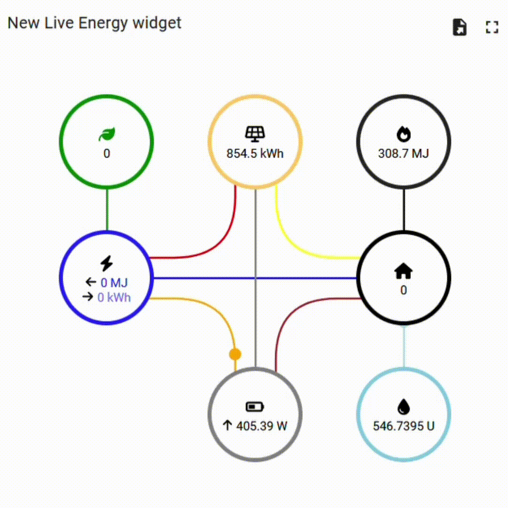

# Energy widget for IRIS

A simple energy widget with real-time data.



## Features

Includes :
  - up to 7 different energy sources and 10 different datapoints.
  - Up to 8 different animations
  - Automatic resizing capabilities
  - Automatic data updating capabilities with real-time data

## Development

The development scripts are in the ```src``` folder.

If you'd like to use the code :
  - Fork the repo
  - Run ```npm run build```, a ```.dist``` folder will be generated.
  - Use the ```.dist/bundle.js``` for the javascript file, ```src/template.html``` for the html and ```src/style.css``` for the css.

## Authors / Aknowledgments

The project author is : Sajidur Rahman.

## Status

Project status : Stable version

## Documentation

Datapoints [here](./docs/datapoints.md).

Thingsboard [here](./docs/thingsboard.md).
