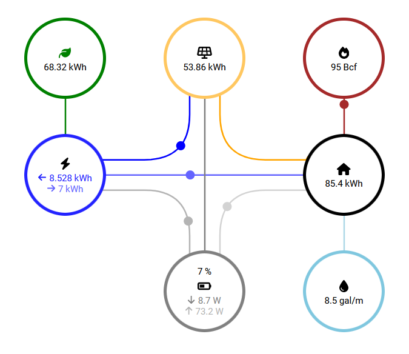

# Energy widget for IRIS

A simple energy widget with real-time data.



## Features

Includes :
  - Up to 7 different energy sources and 10 different datapoints
  - Up to 9 different animations
  - Automatic resizing capabilities
  - Automatic data updating capabilities using real-time data

## Code

### Development

The development scripts are in the ```src``` folder.

### Using the code in Thingsboard

1. Fork the repo
2. Run ```npm i``` to install the dependencies.
3. Run ```npm run build```, a ```.dist``` folder will be generated.
4. Use the ```.dist/bundle.js``` for the minified javascript file, ```src/template.html``` for the html, ```src/style.css``` for the css and ```src/settings-schema.json``` for settings schema.

## Authors / Aknowledgments

The project author is : Sajidur Rahman.

## Status

Project status : Stable version

## Documentation

Datapoints [here](./docs/datapoints.md).

Thingsboard [here](./docs/thingsboard.md).
