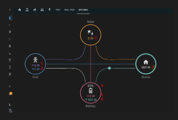
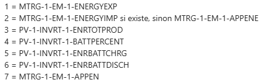

# DataPoints

Voici les data points avec lesquels le widget travaille.

## Overview

### Schéma

### Nomenclature

## Description

1. APPENE : Énergie apparente
2. ENERGYEXP : Énergie exportée vers le réseau électrique
3. ENERGYIMP : Énergie importée depuis le réseau électrique
4. ENRTOTPROD : Énergie totale produite par le solaire
5. BATTPERCENT : Batterie restante en pourcentage
6. ENRBATTCHRG : Taux de recharge de la batterie
7. ENRBATTDISCH : Taux de décharge de la batterie
